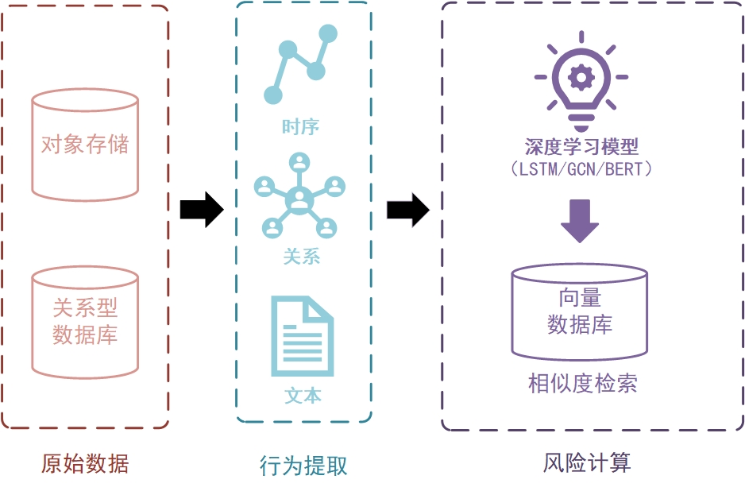

# DeepRisk - 基于深度学习的风控平台

[](https://opensource.org/licenses/MIT)
[](https://www.python.org/)
[](https://openjdk.org/)
[](https://vuejs.org/)

## 前言

研究生期间校企合作项目改造而来的开源智能风控平台，出于简化考虑仅展示核心模块。

## 问题背景

数字化时代，金融、电商、医疗、互联网等行业面临日益复杂的风险挑战，传统规则引擎已无法适应多变的风险场景。主要痛点：

- **规则局限**: 难以覆盖复杂欺诈模式
- **适应性差**: 无法快速应对新兴风险
- **维护成本高**: 规则更新依赖人工干预

## 解决方案

DeepRisk通过多种神经网络模型提取用户行为特征，再利用ANN (Approximate Nearest Neighbor) 进行相似度匹配，实现数据驱动的风险识别。



## 项目架构

| 描述 | 框架 |
|---------|----------|
| 前端框架 | Vue 3.4.0 |
| UI组件库 | Element Plus 2.3.14 |
| 图表库 | ECharts 5.4.3 |
| HTTP客户端 | Axios 1.6.2 |
| 路由管理 | Vue Router 4.2.5 |
| 后端API框架 | FastAPI 0.116.1 |
| Java后端框架 | Spring Boot 3.0.13 |
| ORM框架 | Spring Data JPA 3.0.13 |
| 数据库 | MySQL 8.0.33 |
| 缓存数据库 | Redis 5.0.8 |
| 向量数据库 | RediSearch 2.8 |
| 消息中间件 | RabbitMQ 3.13.7 |
| 消息中间件客户端(Python) | Pika 1.3.2 |
| 消息中间件客户端(Java) | Spring AMQP 3.0.13 |
| 深度学习框架 | PyTorch 2.1.0 |
| 数据处理 | Pandas 2.0.3, NumPy 1.24.3 |
| 机器学习 | Scikit-learn 1.3.0 |
| 配置中心 | Nacos  |
| 容器化 | Docker |
| 反向代理 | Nginx |

## 效果展示

## 🚀 快速开始

### 环境要求

- Docker 20.10+
- Docker Compose 2.0+
- Python 3.11+
- Java 17+
- Node.js 16+
- MySQL 8.0+
- Redis 5.0+
- RabbitMQ 3.13+

### 安装部署

1. **克隆项目**

```bash
git clone https://github.com/your-username/DeepRisk_Server.git
cd DeepRisk_Server
```

2. **配置环境变量**

```bash
# 复制环境变量模板
cp .env.example .env
# 编辑配置文件
vim .env
```

3. **启动服务**

```bash
# 启动所有服务
docker-compose up -d

# 查看服务状态
docker-compose ps
```

4. **访问系统**

- 前端界面: http://localhost:8080
- 默认账号: admin / demo123

### 开发环境搭建

#### 后端服务 (Java)

```bash
cd DeepRisk-audit-server
mvn clean install
mvn spring-boot:run
```

#### 分析服务 (Python)

```bash
cd DeepRisk-analyze-server
pip install -r requirements.txt
python main.py
```

#### 前端服务 (Vue.js)

```bash
cd DeepRisk-frontend
npm install
npm run serve
```

## 🤝 贡献指南

我们欢迎所有形式的贡献！请遵循以下步骤：

1. Fork 本仓库
2. 创建特性分支 (`git checkout -b feature/AmazingFeature`)
3. 提交更改 (`git commit -m 'Add some AmazingFeature'`)
4. 推送到分支 (`git push origin feature/AmazingFeature`)
5. 开启 Pull Request

### 开发规范

- 遵循现有代码风格
- 添加适当的测试用例
- 更新相关文档
- 确保所有测试通过

## 📄 许可证

本项目基于 MIT 许可证开源 - 查看 [LICENSE](LICENSE) 文件了解详情。

## 🙏 致谢

感谢所有为这个项目做出贡献的开发者们！

## 📞 联系我们

如有问题或建议，请通过以下方式联系：

- 提交 Issue
- 发送邮件至: [your-email@example.com]
- 加入讨论群: [群号或链接]

